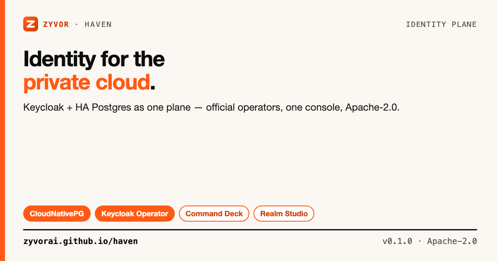

# Haven

[](https://github.com/zyvorai/haven/actions/workflows/ci.yml)
[](LICENSE)
[](https://zyvorai.github.io/haven/)
[](versions.env)
[](versions.env)
[](CHANGELOG.md)



**Identity for the private cloud.**

📖 **[Read the full docs](https://zyvorai.github.io/haven/)** — getting started, console, runbook, and production overlay.

One intent. One console. Official Keycloak + HA Postgres that actually ship together.

## Contents

- [Why Haven](#why-haven)
- [Is this for you?](#is-this-for-you)
- [What you get](#what-you-get)
- [Quick start](#quick-start)
- [Console](#console)
- [Install with Helm](#install-with-helm)
- [Production overlay](#production-overlay)
- [Documentation](#documentation)
- [License](#license)

## Why Haven

The official Keycloak Operator runs Keycloak well. It **does not** manage the database. That gap is where production identity dies.

| Pain | What teams actually do | What Haven does |
|---|---|---|
| Database is “bring your own” | Bitnami chart, random StatefulSet, forgotten RDS URL | CloudNativePG cluster owned by the same plane |
| Secrets are tribal knowledge | `kubectl create secret` in Slack | Generated, rotated, referenced automatically |
| First-boot is a scavenger hunt | Hunt `-initial-admin`, guess hostname, fight TLS | Wizard + ready URL + operator bootstrap secret |
| Day-2 is two UIs and a prayer | kubectl + Keycloak admin, no backup story | One console: plane health, DB, realms, clients, backups |
| Multi-tenant private cloud | One Keycloak, many undocumented realms | Realms as first-class tenants with platform OIDC clients |

Haven composes **official** CloudNativePG and the **official** Keycloak Operator. No forks. No custom Keycloak image required for v0.

## Is this for you?

Haven is a small, open-source (Apache-2.0) **packaging/operations layer** over the official Keycloak Operator and CloudNativePG — not a replacement IdP, not managed SaaS, and not a Keycloak fork.

| | **Haven** | Plain Keycloak Operator | Auth0 / Okta | Authentik | Zitadel | AWS Cognito |
|---|---|---|---|---|---|---|
| Primary scope | Keycloak + HA Postgres as one plane | Keycloak lifecycle only — BYO database | Managed cloud IdP | Self-hosted IdP | Self-hosted IdP | Managed (AWS-tied) |
| Database included | Yes — CloudNativePG | No | N/A | You bring your own | You bring your own | N/A |
| Self-hosted / private cloud | Yes | Yes | No | Yes | Yes | No |
| License | Apache-2.0 | Apache-2.0 (Keycloak) | Proprietary | Apache-2.0/AGPL | Apache-2.0 + commercial | Proprietary |
| Identity engine | Keycloak (official, unmodified) | Keycloak | Proprietary | Custom | Custom | Custom |

*(General characterizations as of writing — verify against each project's own docs.)*

> **Maturity (honest):** repository framed as **v0** — compose overlays, CLI, and CRDs are defined; Helm today “installs RBAC only (controller/console images unpublished)” until you opt in. Full Kubebuilder reconcile is v1, in progress. Production overlay is “a shape, not a one-command install.” Tagged release: `0.1.0`. See [docs/roadmap.md](docs/roadmap.md).

New here? [docs/faq.md](docs/faq.md) · [docs/troubleshooting.md](docs/troubleshooting.md)

## What you get

- **`IdentityPlane`** — one CR for Postgres + Keycloak + certs + ingress (controller path in v1)
- **Compose today** — `deploy/overlays/{dev,prod}` are the exact manifests the controller will render
- **Command Deck** — live plane + Keycloak health in one glass
- **Realm Studio** — realms, users, clients, IdPs without living in the Keycloak admin UI
- **CLI** — `deploy`, `status`, `doctor`, `admin`, `backup`
- **Private-cloud defaults** — NetworkPolicies, TLS, metrics on in `production`

```text
  you ──► IdentityPlane CR ──► Haven controller (v1)
                                   │
                    ┌──────────────┼──────────────┐
                    ▼              ▼              ▼
              CloudNativePG   Keycloak CR    Certs + Gateway
              (HA Postgres)   (official op)  (cert-manager)

  v0 compose path: deploy/overlays/{dev,prod}  (no controller required)
```

**Scope:** Haven deploys and operates Keycloak + PostgreSQL (CloudNativePG). It is **not** an AI agent or app-data tool — the Postgres cluster is Keycloak’s store, not your app OLTP. Pinned versions: [`versions.env`](versions.env).

## Quick start

```bash
git clone https://github.com/zyvorai/haven.git
cd haven

# 1. Operators (once per cluster)
./deploy/operators/install.sh

# 2. Postgres + Keycloak
make dev
make wait
make doctor
make admin
```

| | |
|---|---|
| Keycloak Admin | `http://auth.127.0.0.1.nip.io/admin` |
| Bootstrap secret | `platform-initial-admin` in namespace `identity` |
| First realm | `make realm-import` (optional) |

```bash
# Remote lab console
./scripts/deploy-remote.sh <ephemeral-ip> operator
# → http://<ephemeral-ip>:30742/login  — docs/lab-host.md

# UI local
make ui-install && make ui-dev   # http://localhost:5173
```

## Console

Served by `haven-console` (Go API + embedded SPA):

| Route | What |
|---|---|
| `/deck` | Command Deck — live plane + Keycloak health |
| `/planes` | IdentityPlane fleet |
| `/atlas` | Topology: Console → Ingress → Keycloak → Postgres |
| `/realms` | Realm Studio (users, clients, IdPs, events) |
| `/clients` | Cross-realm OIDC clients |
| `/deploy` | Deploy wizard |
| `/settings` | Keycloak connect, theme, password changes |

Details: [docs/console.md](docs/console.md).

## Install with Helm

```bash
helm install haven oci://ghcr.io/zyvorai/charts/haven --version 0.1.0 \
  --set controller.enabled=true \
  --set console.enabled=true
```

Images: `ghcr.io/zyvorai/haven-console:0.1.0` · `ghcr.io/zyvorai/haven-controller:0.1.0`. Controller and console default to `enabled: false`; chart installs RBAC by default.

## Production overlay

`deploy/overlays/prod` is a shape, not a one-liner. Read [docs/production-overlay.md](docs/production-overlay.md) before apply:

1. `./hack/gen-prod-secrets.sh` — do not use the placeholder password
2. Wait for CNPG, then `./hack/sync-cnpg-ca.sh` (Keycloak verifies DB TLS)
3. Issue `platform-tls` from your ClusterIssuer
4. Configure backups separately ([docs/backups.md](docs/backups.md))

### Design principles

1. **One object, two runtimes** — DB and Keycloak share a lifecycle; default `reclaimPolicy: Orphan`
2. **Operators stay official** — compose CloudNativePG and Keycloak Operator; no forks
3. **Secrets never leave the cluster** — operator bootstrap secret is source of truth in v0
4. **Git is optional** — console can write CRs; Flux/Argo can own the same CRs
5. **Private-cloud defaults** — NetworkPolicies, TLS, metrics on in `production`
6. **Identity is a platform service** — first realm can mint OIDC clients for Kubernetes API, Grafana, Argo CD, Zeus OS

## Documentation

| Doc | When to read |
|---|---|
| [zyvorai.github.io/haven](https://zyvorai.github.io/haven/) | Product docs |
| [docs/faq.md](docs/faq.md) | Deciding whether to adopt |
| [docs/getting-started.md](docs/getting-started.md) | First deploy |
| [docs/troubleshooting.md](docs/troubleshooting.md) | Real operational issues |
| [docs/console.md](docs/console.md) | Auth, routes, remote deploy |
| [docs/architecture.md](docs/architecture.md) | CRDs, reconcile order |
| [docs/roadmap.md](docs/roadmap.md) | v0 / v1 / v2 scope |

Social assets: [docs/social/](docs/social/).

## License

### Open source (Apache-2.0)

Licensed under the [Apache License, Version 2.0](LICENSE). Personal, lab, and commercial production use at no charge, subject to Apache-2.0 (preserve notices / NOTICE where required). See [NOTICE](NOTICE) for third-party attribution (Keycloak and CloudNativePG remain under their own licenses).

### Enterprise

Production support, SLAs, and Zyvor Enterprise products are licensed separately.
Contact [sales@zyvor.dev](mailto:sales@zyvor.dev) or see [zyvor.dev](https://zyvor.dev).
