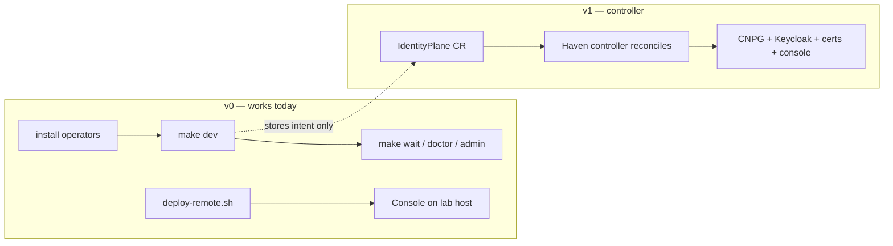

---
hero:
  eyebrow: IDENTITY PLANE
  title: Haven
  lead: >-
    Keycloak + HA PostgreSQL, shipped and operated as one product — one
    console, one intent object, day-2 ops that don't require reading three
    operators' docs.
  swatches:
    - {label: "Keycloak Operator 26.7.2"}
    - {label: "CloudNativePG 1.27.1"}
    - {label: "Apache-2.0"}
  highlights:
    - {value: "v0.1.0", label: "Only tagged release today — a v0 packaging layer, not the v1 controller", footnote: "1"}
    - {value: "3", label: "Custom resources: IdentityPlane, RealmBundle, OidcClient", footnote: "2"}
    - {value: "10", label: "Reconciliation steps from namespace to a Ready plane", footnote: "2"}
    - {value: "13", label: "Deterministic security rules Haven Guard checks (HAVEN001–013)", footnote: "3"}
    - {value: "5", label: "CLI commands: deploy, status, doctor, admin, backup", footnote: "4"}
  hub_bands:
    - {icon: "❓", title: "FAQ", description: "Decide whether Haven fits my use case.", href: "faq.md"}
    - {icon: "🚀", title: "Getting started", description: "Run Keycloak + Postgres on a local cluster, or deploy the console to a lab host.", href: "getting-started.md"}
    - {icon: "📘", title: "Runbook", description: "Install operators, four deployment paths, day-2 ops, failure cheatsheet.", href: "runbook.md"}
    - {icon: "🖥️", title: "Console", description: "Sign in, change passwords, wire OIDC.", href: "console.md"}
    - {icon: "🧩", title: "Architecture", description: "CRDs, reconcile order, profiles, trust model.", href: "architecture.md"}
footnotes:
  - {marker: "1", text: "The README states only one tagged release exists, 0.1.0, and frames this repository as v0 — the Helm chart installs RBAC only today; the full Kubebuilder reconcile loop is v1, in progress.", href: "https://github.com/zyvorai/haven#readme", href_label: "See the README."}
  - {marker: "2", text: "IdentityPlane, RealmBundle, and OidcClient are the three CRDs; the controller applies them across a 10-step reconciliation order from namespace/NetworkPolicy creation through marking the plane Ready.", href: "architecture.md", href_label: "See Architecture."}
  - {marker: "3", text: "Haven Guard's rule table lists HAVEN001 through HAVEN013 across critical/high/medium/low severity.", href: "security-posture.md", href_label: "See Security posture."}
  - {marker: "4", text: "The CLI (./cli/haven) and Makefile targets cover deploy, status, doctor, admin, and backup.", href: "cli.md", href_label: "See CLI."}
---

Haven turns Keycloak and PostgreSQL into one private-cloud identity product. These docs cover how to deploy it, operate it day-to-day, and how the pieces fit together.

**Published site:** [zyvorai.github.io/haven](https://zyvorai.github.io/haven/) · **Preview locally:** `make docs-serve`

> **Convention:** run every command from the Haven repo root (the directory that contains `Makefile`, `cli/haven`, and `scripts/`).

## The three custom resources

- **IdentityPlane**
  The root object. One plane ≈ one Keycloak cluster + one PostgreSQL cluster + how the world reaches them — profile, database, Keycloak version/resources, exposure, and bootstrap realm/clients all live here.
- **RealmBundle**
  A declarative realm (users optional, clients, roles, IdPs, theme), applied via the Keycloak Realm Import CR plus a small Haven overlay for what the import job doesn't cover — client secrets stored as Kubernetes Secrets, rotation.
- **OidcClient**
  A client that belongs to a realm and must exist for platform SSO. The controller ensures the client exists in Keycloak and writes a Secret the workload can mount (`client-id`, `client-secret`, `issuer`).

---

## Documentation map

### Operations

| Doc | Contents |
|---|---|
| [Getting started](getting-started.md) | Choose a deployment path (local, lab, production) |
| [Runbook](runbook.md) | Install operators, four deployment paths, day-2 ops, failure cheatsheet |
| [Lab host](lab-host.md) | Endpoints, SSH, OIDC wiring for **<ephemeral-ip>** |
| [Console](console.md) | Routes, auth modes, remote deploy, local UI dev |
| [Tutorials](tutorials.md) | Console recipes: realms, clients, passwords |
| [CLI](cli.md) | `./cli/haven` commands and Makefile targets |

### Design

| Doc | Contents |
|---|---|
| [Architecture](architecture.md) | CRDs, reconcile order, profiles, trust model |
| [UX](ux.md) | Command Deck, deploy wizard, visual language |
| [Private cloud](private-cloud.md) | Zeus OS mapping, platform SSO catalog, tenancy |
| [Roadmap](roadmap.md) | v0 / v1 / v2 scope |

### Deploy overlays (in-tree)

| Path | Contents |
|---|---|
| [production-overlay.md](production-overlay.md) | Production prerequisites: secrets, TLS, CNPG CA |
| [backups.md](backups.md) | Backup object store setup |

---

## Deployment paths at a glance

| Path | Status | Entry point |
|---|---|---|
| **Compose (local)** | Supported | `make dev` — see [runbook Path B](runbook.md#path-b) |
| **Lab console** | Supported | `./scripts/deploy-remote.sh <ephemeral-ip> operator` — see [lab-host.md](lab-host.md) |
| **Production overlay** | Shape only | [production-overlay.md](production-overlay.md) |
| **IdentityPlane CR** | Intent only (until v1 controller) | `make samples-dev` |

---

## External references

- [Haven manual](https://zyvor.dev/docs/haven-manual) — user-facing docs on zyvor.dev
- [Common workflows](https://zyvor.dev/docs/haven-manual/workflows)
- [Page-by-page guides](https://zyvor.dev/docs/haven-manual/pages)
- [Contributing](contributing.md) — dev setup, doc conventions, PRs
