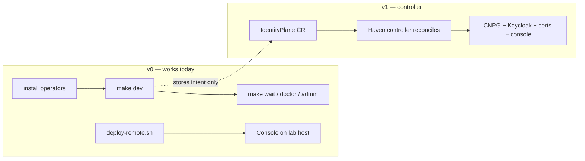

# Haven documentation

Haven turns Keycloak and PostgreSQL into one private-cloud identity product. These docs cover how to deploy it, operate it day-to-day, and how the pieces fit together.

> **Convention:** run every command from the Haven repo root (the directory that contains `Makefile`, `cli/haven`, and `scripts/`).

---

## Start here

| I want to… | Read |
|---|---|
| Run Keycloak + Postgres on a local cluster | [Getting started → Local cluster](getting-started.md#local-cluster-compose-path) |
| Deploy the Haven console to the lab host | [Getting started → Lab host](getting-started.md#lab-host-remote-console) |
| Sign in, change passwords, wire OIDC | [Console](console.md) |
| Follow day-2 recipes in the UI | [Tutorials](tutorials.md) |
| Install or troubleshoot the stack | [Runbook](runbook.md) |
| Understand CRDs, reconcile order, profiles | [Architecture](architecture.md) |
| See what's shipped vs planned | [Roadmap](roadmap.md) |

---

## Documentation map

### Operations

| Doc | Contents |
|---|---|
| [Getting started](getting-started.md) | Choose a deployment path (local, lab, production) |
| [Runbook](runbook.md) | Install operators, four deployment paths, day-2 ops, failure cheatsheet |
| [Lab host](lab-host.md) | Endpoints, SSH, OIDC wiring for **175.110.122.71** |
| [Console](console.md) | Routes, auth modes, remote deploy, local UI dev |
| [Tutorials](tutorials.md) | Console recipes: realms, clients, passwords |
| [CLI](cli.md) | `./cli/haven` commands and Makefile targets |

### Design

| Doc | Contents |
|---|---|
| [Architecture](architecture.md) | CRDs, reconcile order, profiles, trust model |
| [UX](ux.md) | Command Deck, deploy wizard, visual language |
| [Private cloud](private-cloud.md) | Zeus OS mapping, platform SSO catalog, tenancy |
| [Roadmap](roadmap.md) | v0 / v1 / v2 scope |

### Deploy overlays (in-tree)

| Path | Contents |
|---|---|
| [deploy/overlays/prod/README.md](../deploy/overlays/prod/README.md) | Production prerequisites: secrets, TLS, CNPG CA |
| [deploy/overlays/prod/backup/README.md](../deploy/overlays/prod/backup/README.md) | Backup object store setup |

---

## Deployment paths at a glance

| Path | Status | Entry point |
|---|---|---|
| **Compose (local)** | Supported | `make dev` — see [runbook Path B](runbook.md#path-b--compose-today-supported-in-v0) |
| **Lab console** | Supported | `./scripts/deploy-remote.sh 175.110.122.71 sus` — see [lab-host.md](lab-host.md) |
| **Production overlay** | Shape only | [prod README](../deploy/overlays/prod/README.md) |
| **IdentityPlane CR** | Intent only (until v1 controller) | `make samples-dev` |

---

## External references

- [Haven manual](https://zyvor.dev/docs/haven-manual) — customer-facing docs on zyvor.dev
- [Common workflows](https://zyvor.dev/docs/haven-manual/workflows)
- [Page-by-page guides](https://zyvor.dev/docs/haven-manual/pages)
